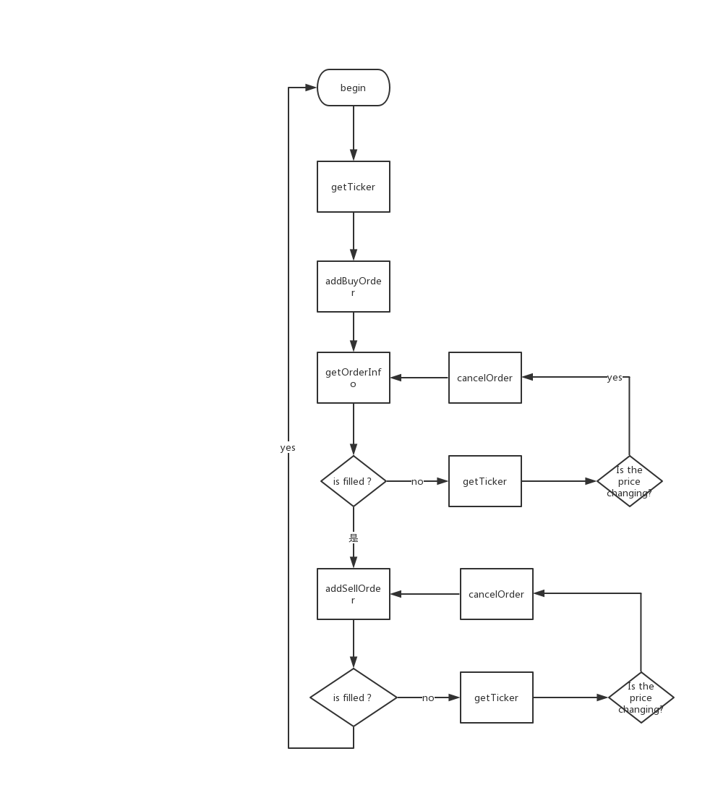
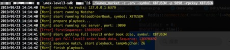
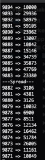

# 在KuMEX使用L3

伴随着17年的牛市，大量的人关注到了比特币，其中大多数都是程序员群体。得益于各大交易所便捷的API使用，很多程序员开始使用API进行交易，甚至把股票期货的一些策略用于虚拟货币，不少人在这上面赚到了第一桶金。赚钱的事情总是吸引人的，特别是对于大多数程序员来讲，能够把自己的代码直接转换成金钱，甚至写好的策略在执行的时候，自己躺在床上就有钱砸过来的感觉是很美妙的。那么废话不多说，我们直奔主题怎么在KuMEX使用L3。

## 为什么要使用L3
在讲为什么要使用L3之前，首先我们要先解释什么是L3 ，L3的全称是Level 3 Data 又叫 Full MatchEngine Data。是交易所提供的一种接口，会推送市场的所有交易有关信息，包括所有人的挂单，撤单，成交等等，而且这个推送会优先于数据库处理推送，相当于你收到的这个推送和交易所的后端系统是同步的，也就是最快的。

对于交易者来讲，快的重要性我无需多说，大家都懂。那么我们现在来讲除了第一时间收到推送之外，L3的优势在哪里，为什么我们要使用L3。在讲清楚这个问题之前，我们先来整理一下完成一个简单量化交易的策略的思路，假设我们现在要完成一个策略，追BTC/USDT，做盘口买卖，策略很简单，我持有USDT，每次下单都比盘口买一价高一点点 买入总量为0.05BTC，完全买入之后再比卖一价低一点点，卖出0.05BTC，从中赚取差价。假设我们全部通过传统REST接口实现这个策略，会是怎么样的呢。我们来看这样一个简单的流程图。我们简单说明下

getTicker是获取盘口价格的接口

addBuyOrder是下买单

addSellOrder是下卖单

getOrderInfo是获取订单信息

cancelOrder是取消订单 

相信很多人在一开始做量化交易的时候都是这样写策略的，在一个循环里面不断的去下单然后一直去拿价格并且获取订单信息来做进一步的操作。相信你们肯定会遇到下面这几个问题，

1，下单之后怎么确定自己是否成功，有时候就算返回失败或者网络原因抛出异常也有可能是成功的，

2，getOrderInfo拿到的结果并不是准确的，假设你挂了0.05BTC的买单 你发出getOrderInfo的时候你被吃了0.01，但是在你拿到结果做下一步操作的时候，你的订单又被吃了0.02，你也就是拿到的结果是不准确的。

3，cancelOrder怎么确保一定cancel了，我发出cancel的时候刚好成交了怎么算。

4，如果通过一直getOrderInfo去检查订单的状态，由于getOrderInfo的非及时性，比如你撤单或者下单之后马上getOrderInfo是不一定能够成功的

5，如果我想提高速度，使用异步下单，没办法在主线程拿到orderId，上面这四个问题又会变的更加严峻

6，我如何知道，在同一个价格我的排序是否靠前

7，在循环里面频繁的请求接口，会触发交易所的api频率控制

8，慢。一个接口至少30ms，我明明已经成交了，但是要等到getOrderInfo更新信息是很慢的，我如何第一时间拿到自己的成交并且策略做出相应的回应。

9，没有手段能够监控到盘面其他订单的动向

当然类似的问题还有很多，说来说去其实核心就两点：

	1，如何准确，快速的维护自己的订单状态.

	2，快速获取当前行情。

	3，如何避免交易所的api频率限制。

这三点可以说是高频交易者的核心诉求。当然这三点通过使用L3都能够完美的解决。一开始我们已经讲到了，L3的市场的所有数据，那么所谓的市场所有数据，到底包含哪些我们又如何使用呢？在这里我们以KuCoin举例（KuMEX类似）。你如果通过websocker订阅了L3市场数据，会给你推送如下消息，RECEIVED, OPEN, UPDATE, MATCH, DONE。详细的消息格式可以查看官方文档

https://docs.kucoin.com/#full-matchengine-data-level-3

https://docs.kumex.com/#full-matching-engine-data-level-3

具体的使用方法我们会在下一篇文章详细阐述。

这些消息包含了一个订单能发生的所有动作，聪明如你应该想到了，我既然收到了所有订单的消息，那么其中肯定包含我自己的订单，我就能知道我自己订单的状态了。而且由于KuCoin/KuMEX支持clientOid，你可以直接通过自己定义的clientOid，在RECEIVED消息中和orderId关联起来，实现订单状态的跟踪。

到这里肯定大家有一个疑问，为什么不直接拿到orderId去追踪订单消息，而要自己定义clientOid呢？很简单，当你调用addBuyOrder的时候你确实会收到一个返回的orderId，但是由于L3实在是太快了，在你收到返回的orderId之前，对不起 RECEIVED, OPEN,已经先给你推送过来了，也就是说你还没收到返回，另外一个进程就已经收到推送了，如果你还在等返回的话，你的另外一个进程根本不知道这个是你自己的订单。

而且L3是来自于交易所最准确的数据，你下单一定会有RECEIVED，撤单正常情况下会有DONE并且原因是cancel。没收到就是失败，而且L3有sequence来保障消息的连续，也就是说你收到的消息一定是连续的不中断的，不会出现漏消息的情况，你没收到100%是没发生，而不是漏消息（很多交易所提供websock，但是你没办法确定是你下单失败还是消息推漏了）。

除了使用L3维护自己的订单状态之前，L3还有一个最大的作用是，本地构建买卖盘。相当于你通过接受市场数据，你可以再内存中维护一个和交易所完全同步的买卖盘，想怎么调用就怎么调用。并且这个买卖盘更加的准确，同样价格哪个订单排前面，哪个订单排后面都知道。
最后我们再来回顾下前面提到的问题，看看L3的如何解决的，

1，下单之后怎么确定自己是否成功，收到RECEIVE才算成功

2，如果通过一直getOrderInfo去检查订单的状态，由于getOrderInfo的非及时性，比如你撤单或者下单之后马上getOrderInfo是不一定能够成功的。无需getOrderInfo每次成交都已推送的消息为准。

3，cancelOrder怎么确保一定cancel了，以收到DONE消息，并且原因为CANCELED为准

4，如果通过一直getOrderInfo去检查订单的状态，所有的订单信息变更以消息为准

5，如果我想提高速度，使用异步下单，使用clientOid并且在RECEIVE中关联clientOid和oredrId

6，我如何知道，在同一个价格我的排序是否靠前。L3构建的买卖盘包含此信息

7，在循环里面频繁的请求接口，会触发交易所的api频率控制。使用了L3之后你只会使用
addOrder和cancelOrder两个接口，不需要查询订单信息，不需要查询买卖盘价格。极大的减少了API调用，当然如果你光addOrder和cancelOrder都能触发限制，请联系kucoin/kumex，我们很乐意为您这样的api使用者提供帮助。

8，慢。一个接口至少30ms，我明明已经成交了，但是要等到getOrderInfo更新信息是很慢的，我如何第一时间拿到自己的成交并且策略做出相应的回应。L3的消息推送甚至比接口返回结果还要快。

9，没有手段能够监控到盘面其他订单的动向。L3会推送所有订单的变更信息，你完全可以监控盘面任何一个订单的状态，

既然L3有这么多好处，接下来我们会讲到L3的使用方法并且提供一个完整可用的例子以及一个SDK。

## 怎么使用L3

为了方便大家使用L3，我们提供KuMEX的L3的开箱即用的SDK以及python的demo。它的地址是https://github.com/Kucoin/kumex-level3-sdk
。SDK包含两个功能

1，本地构建好的orderbook，可以直接使用

2，推送订单信息到指定的redis频道，需要redis支持。

接下来我给大家讲解如何使用L3，

1，按照readme的步骤clone这个仓库，这个仓库包括一个golang语言的 完整L3实现，和python的demo，按照步骤编译好二进制程序，当然你也可以直接下载我们编译好的release二进制程序来使用。（这套golang的实现，我们已经在linux生产环境下经过大量的7*24小时的使用和测试，性能和稳定性都非常好，请放心使用）

2，直接带参数运行编译好的二进制程序

__./kumex_market -c .env -symbol XBTUSDM -p 9090 -rpckey XBTUSDM__

-c 参数是指定配置文件

-symbol 参数是运行的交易对

-p 是rpc监听的端口号

-rpckey 是会写入到redis的本程序的运行端口(redis key: kumexMarket:rpcKey:{$symbol}:{$rpckey})，方便集群部署的自动化

3，保持kumex_market运行的情况下，进入kumex-level3-sdk/demo/python-demo/demo 目录 运行

__python KuMEXOrderBook.py__

在这个demo中我们再本地展示了买卖盘上下12档的数据，没有调用任何http的方法和线上完全一致且实时同步，更高级的是， 你甚至能知道每一档价格，各个订单排序的先后。
4，orderMonitor.py 文件提供了一个订单下单的追踪进程，正如上文所说，这个需要redis来做中间件并且在，提供消息的订阅和消费

5，demo.py 提供了可以运行的一个简单的网格策略，需要先运行orderMonitor.py 

由于涉及到第4和5步下单，需要在__kumex-level3-sdk/demo/python-demo/tools/config.py__
中配置你的apikey和sercet。

整个level3-sdk的使用至此就介绍完毕了。是不是非常的简单，大家都来试一试吧，

最后祝大家都在KuMEX成功开启量化交易的财富之旅。

