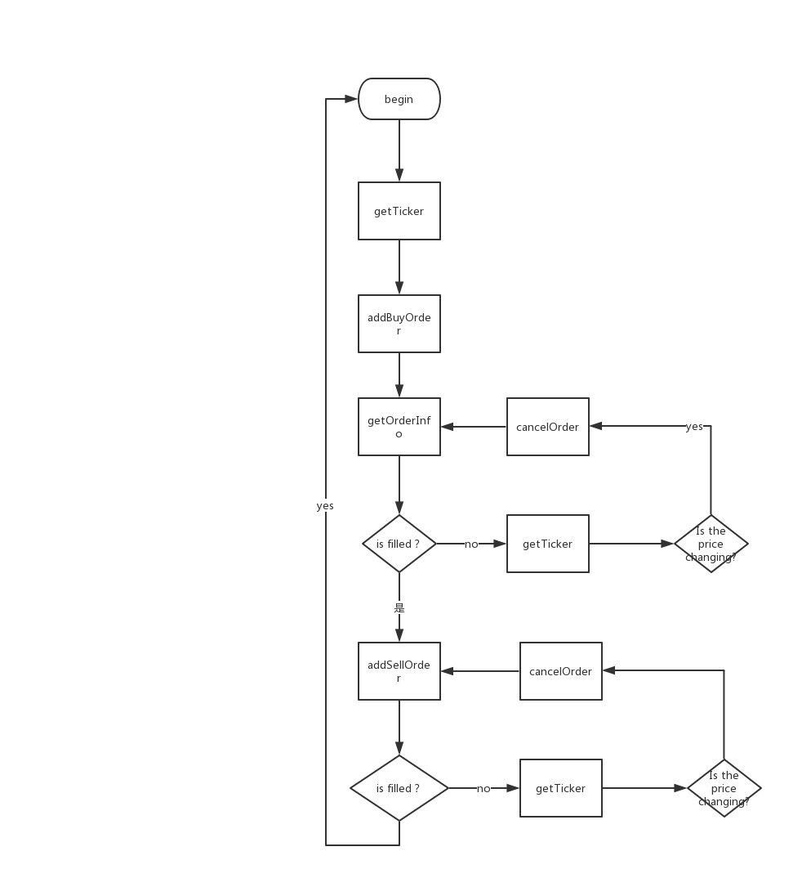

# 在kumex使用L3

Starting late 2017 when we saw the bullish crypto market, Bitcoin has gained increasing attention from a growing population of investors, with the group coders (in a broad sense) being one major composition.
These guys, with solid programming know-how, managed to earn their first barrels of gold by applying stock and futures trading strategies to the crypto world via Application Program Interface (API) offered by crypto exchanges.
For most coders, to actually monetize the coding gives great sense of achievements, as well as financial success. Just picture yourself lying snug in bed while a machine printing money non-stop at your hand, what more can you ask for?
However, without L3, it’s like you have the money print template, the ink and paper, but you don’t know how to operate the machine. Okay, here comes the handbook of using L3 on KuMex.

## Why to use L3

Prior to answering the question of why, we should start with the question of what. What is L3 exactly? The full name is Level 3 Data, or Full Matching Engine Data. It is a gateway, via which the exchange push trading information including placing orders, cancelling orders, closed orders. What’s even better is that the L3 data push is sync with back-end system, which means traders can get real real-time market data.
Do we need to explain the importance of time sensitivity of information delivery for traders? I don’t think so.
Plus, being swift is just one of several strengths that L3 data push offers. Well, here we go. 

To walk through this topic, going back to its very origin - creating a quantitative technique - is needed. For instance, if I want to run a simple BTC/USDT arbitrage strategy, I’d like to place a 0.05BTC buy order slightly higher than the best bid price, then place a sell order slightly lower than the best ask price after the buy order it’s executed, aiming at taking advantage of the (pretty slim) price spread.
Well, what would it be like if the strategy is carried out via the traditional Representational state transfer (REST) API? The process is shown in the following flow chart:

It is a rather basic strategy frequently used by quant traders, who target arbitrage profits between the price spread by repeatedly place buy/sell orders based on the complete order data. Thus, it’s also quite common to face the following issues:

1. How do you know for sure the order is successfully executed? As sometimes the order might actually be executed even the system reminds you of rollback fails or it throws an exception due to network failures;

2. “GetOrderInfo” might push inaccurate data. Take the above-instanced 0.05BTC order as an example, since the matchmaking takes place in stages, it’s likely the feedback of GetOrderInfo comes when 0.01BTC worth deal is executed, based on which you make the next move, except for that your original order also moves on to the timing when 0.02BTC worth deal is done.

3. “CancelOrder” might be placed simultaneously at the time when the deal is executed. Indeed the odds are high, but things could happen.

4. “GetOrderInfo” outright placing an order might not successfully push data feedback due to its feature of lower time sensitivity.

5. To improve efficiency, sometimes traders may involve in asynchronous orders, which may also fail given that order ID might be unavailable on the main thread. And this will escalate the above four issues.

6. How do I know that my order is at a beneficial status?

7. High API request frequency might trigger a frequency control from the exchange sinde.

8. It’s just too slow. It takes at least 30 milliseconds for GetOrderInfo to deliver feedback, which makes real-time data push and perfect efficiency of implementing new strategy highly unlikely.

9. No accessibility to the data of other orders.

These are just a few among many issues, which after all are related to the following three points:

1. How to get access and maintain your own order status accurately and efficiently?

2. How to get access to the complete real-time market data?

3. How to avoid API frequency control conducted by the exchange?

These three points state the core demand of high-frequency traders, which could be fulfilled via L3, as it pushes the complete market data. So now, it comes to the questions of what exactly does complete market data include, and how to apply the data to the trading strategies?
Take KuCoin (KuMex similarly) as an example, if you subscribe L3 data via Websocket, you will receive full data tagged as (not limited in) RECEIVED, OPEN, UPDATE, MATCH, DONE. For the details, please check the official API documents here:

https://docs.kucoin.com/#full-matchengine-data-level-3

https://docs.kumex.com/#full-matching-engine-data-level-3

As for the usage of L3, we will elaborate the detailed methods in the next article. 

Now, let’s see what are the beauties of complete market data. The first of many would be that it contains data of others’ orders as well as your own order’s, which means no need for separate API requests.

What’s even better is that you can track your order status by associating orderID in the RECDIVED data via the customized clientOid functionality supported by both KuCoin and KuMex. But you might wonder, why not just tracking the order status using orderID, but applying user-defined clientOid?

Think about it, when you call the AddBuyOrder interface, there indeed will be an orderID rolling back - after L3 pushes over RECEIVED and OPEN. And that means, another thread has already complete the information delivery, while you are still waiting for the original data-push, which is included in the information delivery but couldn’t be identified. Sounds very efficient, huh?
Plus, L3 data-push is counted as the most accurate data delivery, while RECEIVED is the standard layout for placing an order. Under the circumstance of withdrawing an order, DONE is the standard layout, with the reason will be specified as cancel.

On top of maintaining your own order status, L3 also helps to architect a local market database. Do I need to specify the difference between calling market data from local server and remote server? Not to mention the real-time local market database details the exact priority queue of all the orders.
Now let’s see how L3 address the above-mentioned issues that REST might have difficulty to fix:
1. How do you know for sure the order is successfully executed - with RECEIVE being delivered.
2. The possible inaccuracy of GetOrderInfo push, as the order might be executed in stages - L3 data push delivers precise and complete order information, no need for getOrderInfo anymore. 
3. How do you know for sure the order is canceled - with DONE being delivered and attributed to the reason of CANCELED.
4. No need for repeated checking order status by calling getOrderInfo - order status changes will be delivered by L3 data push.
5. Calling asynchronous order to improve efficiency, associating clientOid and orderId in RECEIVE, won’t be seeing conflicts between different threads.
6. How do I know my order is in beneficial status - L3 data push will tell you.
7. Concerns over API frequency control - interface calling frequency will significantly drop, as you only trigger two requests, addOrder and cancelOrder. If, however, under such circumstance, the frequency is still triggered, please do contact KuCoin/KuMex, I am more than just sure that they would like to offer extra support to API user like you.
8. Ill-timed. The 30 millisecond-latency for GetOrderInfo to deliver feedback, which makes real-time data push and perfect efficiency of implementing new strategy highly unlikely, is now solved, as L3 data push is much faster.
9. No accessibility to the data of other orders. The issue is now addressed as L3 push full order data, which include every change of each individual order, so that the user could monitor the entire market and make real-time adjustment.

I believe the above-mentioned edges are convincing enough, now the question would be how to make use of L3. Here comes on applicable use case and an SDK.

I believe the above-mentioned edges are convincing enough, now the question would be how to make use of L3. Here comes on applicable use case and an SDK.

## How to make use of L3

With the features of ready-to-use SDK and demo of python (available at https://github.com/Kucoin/kumex-level3-sdk), our L3 is very easy to use. The two major functionalities of SDK are as follows:

1. Locally built orderbook is simply ready to use

2. The order data will be pushed to designated redis channel, which obviously asks for application of redis

Now, please allow me to share the method of application of L3

1. Clone the repository, which includes a set of full realization of Go programming language and python demo, and compile binary program following the readme steps. Or you could download the release binary program compiled by us already. (We have conducted multiple 7*24 tests in Linux production environment, which show excellent stability and functionality, please rest assured to use.)

2. Complided binary program running with parameters

__./kumex_market -c .env -symbol XBTUSDM -p 9090 -rpckey XBTUSDM__

-c stands for configuration files

-symbol stands for available trading pairs

-rpckey stands for running ports programmed in redis, aiming at automated cluster deployment

3. keep kumex_market run ，into kumex-level3-sdk/demo/python-demo/demo files to run python KuMEXOrderBook.py

__python KuMEXOrderBook.py__

In this demo, we illustrate 12-grade data on each of the ask and bid side locally without calling any http methods but still being able to achieve synchronization. What’s better is that it’s all transparent, the price of each grade and the priority queue of the orders.

4. The orderMonitor.py file offers means to monitor the order processing, as stated above, which will need a middleware such as redis to provide data subscription and consumption

5. The demo.py offers a simple grid trading strategy, under the condition that orderMonitor.py is already running

Given that Step 4 and 5 are involved in placing an order, you will have to deploy your apikey and secret in kumex-level3-sdk/demo/python-demo/tools/config.py

This is it, a handbook to make the use of level 3-sdk, pretty straightforward, huh? Come come, give it a shot! Wish you all a wonderful quant-trading adventure on KuMex, and best luck!
)